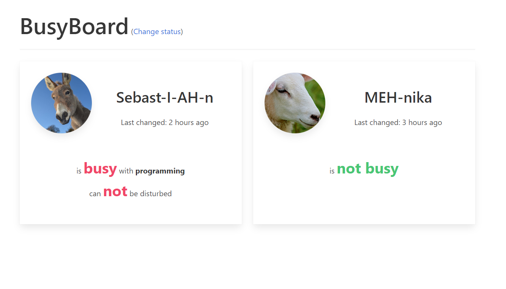

# BusyBoard

As due to COVID-19 regulations in Belgium I'm working from home full-time. Though very often communicating with 
colleagues in online meetings, I wanted to have a platform where I could indicate if I was busy or not and if I could be
disturbed or not to members of my household.

This flask app, which is designed to run on a small home server (e.g. a Raspberry pi) on the local network, is my 
solution.



## Installation

You can install this locally by cloning the repository, creating a virtual environment for the app and installing all
requirements. This can be done using the commands below on MacOS and Linux.

```bash
git clone https://github.com/sepro/BusyBoard ./BusyBoard
cd BusyBoard
python -m venv venv
source venv/bin/activate
pip install -r requirements.txt
```

Windows users need to use a small variation:
```bash
git clone https://github.com/sepro/BusyBoard ./BusyBoard
cd BusyBoard
python -m venv venv
source venv/bin/activate
pip install -r requirements.txt
```

## Running the app

Once everything is installed, you can run the app locally using the command below

```bash
flask run
```

## Running BusyBoard on your server

BusyBoard is a pretty straightforward flask application, depending on your server's configuration there are a number of
ways it could be installed on your system. There is a comprehensive list in the official 
[Flask documentation](https://flask.palletsprojects.com/en/1.1.x/deploying/) how to do this on various systems. Do note
that there is no real security in BusyBoard, so if you choose to deploy on a publicly accessible platform this is at
your own risk.

